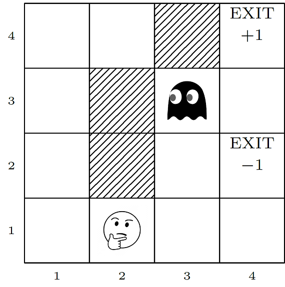

Reinforcement Learning Mini-course
==================================

Get started
-----------
1. Have a look at the slides (assumes some maths background)
2. Start working on the exercises, see code/ReadMe.md

About
-----
Mini-course on reinforcement learning at TUM Informatics 5 Chair Retreat, March 2020
taught by Christian B. Mendl

References
----------
- S. Russell, P. Norvig  
  Artificial Intelligence: A Modern Approach (3rd edition) (2009)
- R. S. Sutton, A. G. Barto  
  Reinforcement Learning: An Introduction (2nd edition)  
  MIT Press (2018)
- Stanford course [CS231n Convolutional Neural Networks for Visual Recognition](http://cs231n.github.io)
- Andrej Karpathy  
  [Deep Reinforcement Learning: Pong from Pixels](http://karpathy.github.io/2016/05/31/rl) (2016)
- David Silver  
  [UCL RL course](http://www0.cs.ucl.ac.uk/staff/d.silver/web/Teaching.html)
- V. Mnih, K. Kavukcuoglu, D. Silver et al.  
  Human-level control through deep reinforcement learning  
  Nature 518, 529 (2015)
- D. Silver, J. Schrittwieser, K. Simonyan et at.  
  Mastering the game of Go without human knowledge  
  Nature 550, 354–359 (2017)
